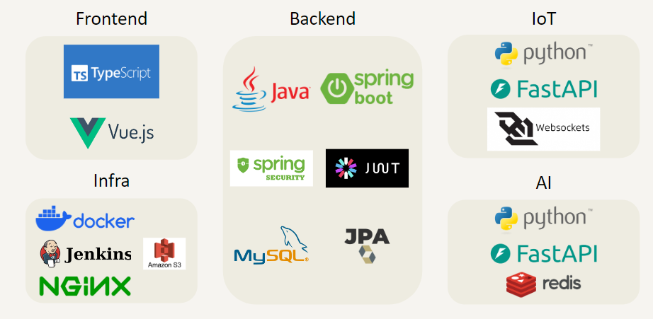
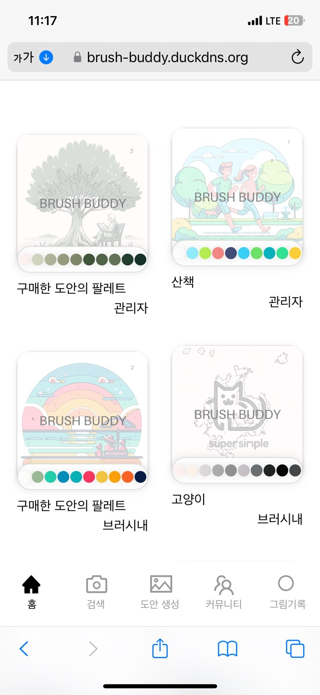
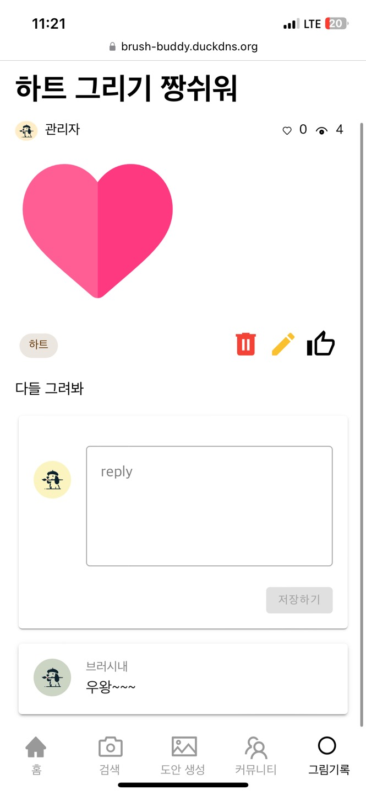
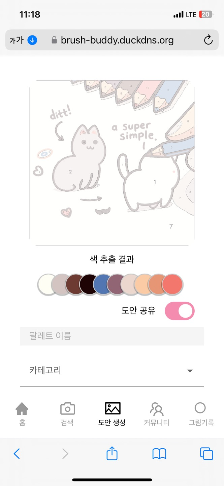
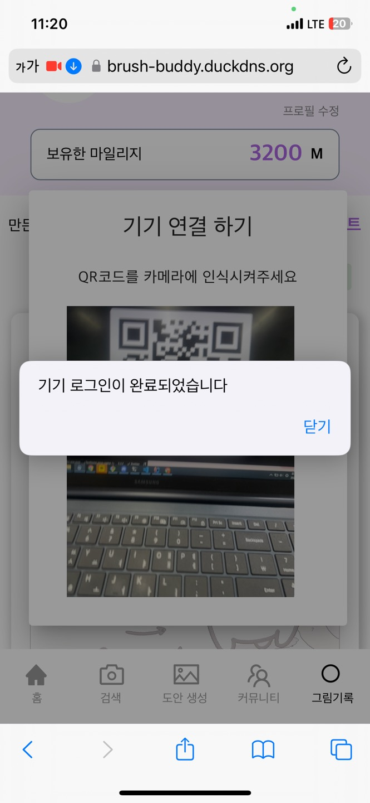
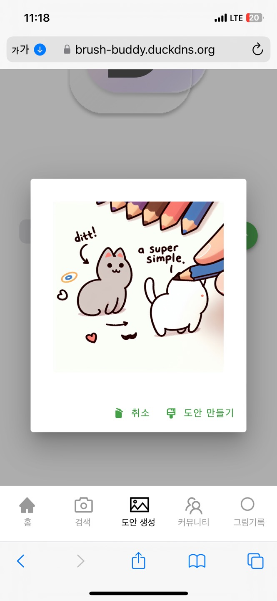

# Brush Buddy -

### 프로젝트 진행 기간

2023.01.09(월) ~ 2023.02.16(금)

## Team Members

  <table>
    <tr>
        <td align="center">
        
      </td>
      <td align="center">
        
      </td>
      <td align="center">
        
      </td>
      <td align="center">
        
      </td>
      <td align="center">
        
      </td>
      <td align="center">
        
      </td>
    </tr>
    <tr>
      <td align="center">
        <a href="">
         김영진
        </a>
      </td>
      <td align="center">
        <a href="https://github.com/">
          백승윤
        </a>
      </td>
      <td align="center">
        <a href="https://github.com/">
          용희원
        </a>
      </td>
      <td align="center">
        <a href="https://github.com/">
          이상협
        </a>
      </td>
      <td align="center">
        <a href="https://github.com/">
          이신애
        </a>
      </td>
      <td align="center">
        <a href="https://github.com/">
          전소민
        </a>
      </td>
    </tr>
  </table>

## 👓 등장 배경

####

## 개요

삼성 청년 SW 아카데미 공통 프로젝트에서 생성형 AI를 활용한 피포 페인팅 서비스를 개발하여 우수상을 수상하였습니다. 
이 서비스는 사용자가 원하는 이미지를 입력하면 생성형 AI가 해당 이미지를 피포 페인팅 도안으로 자동으로 변환해줍니다. 
또한, IoT 기기를 통해 해당 그림에 필요한 물감을 출력해주는 기능도 포함되어 있습니다. 
이를 통해 사용자는 손쉽게 원하는 그림을 페인팅할 수 있습니다.

 
## Usage

### 개발환경

## Service Architecture

### 📂디렉토리 구조

  

  백엔드 디렉토리 구조
  

  
 

  

  프론트엔드 디렉토리 구조
  

    ├── App.vue
    ├── api
    │   ├── axios.ts
    │   ├── board.ts
    │   ├── draft.ts
    │   ├── machine.ts
    │   ├── palette.ts
    │   ├── type.ts
    │   └── user.ts
    ├── assets
    │   ├── background.png
    │   ├── icon
    │   ├── images
    │   ├── kakao.png
    │   └── logo.png
    ├── components
    │   ├── Community
    │   ├── CommunityComponent.vue
    │   ├── Diary
    │   ├── Draft
    │   ├── DraftDetail
    │   ├── NavigationComponent.vue
    │   ├── Palette
    │   ├── Pay
    │   ├── Search
    │   ├── SearchComponent.vue
    │   └── common
    ├── main.ts
    ├── router
    │   └── index.ts
    ├── stores
    │   ├── boardlike.ts
    │   ├── bookmark.ts
    │   ├── counter.ts
    │   ├── image.ts
    │   ├── menutypes.ts
    │   ├── pay.ts
    │   └── user.ts
    ├── views
    │   ├── CommunityBoardListView.vue
    │   ├── CommunityDetailView.vue
    │   ├── CommunityModifyView.vue
    │   ├── DiaryView.vue
    │   ├── DraftCreateAIView.vue
    │   ├── DraftDetailView.vue
    │   ├── DraftPipoMakeView.vue
    │   ├── DraftView.vue
    │   ├── DraftWrite.vue
    │   ├── HomeListView.vue
    │   ├── HomeView.vue
    │   ├── LoginView.vue
    │   ├── PaletteDetailView.vue
    │   ├── SearchView.vue
    │   ├── payCharge.vue
    │   └── payView.vue
    └── vite-env.d.ts

## 주요기능 및 화면

